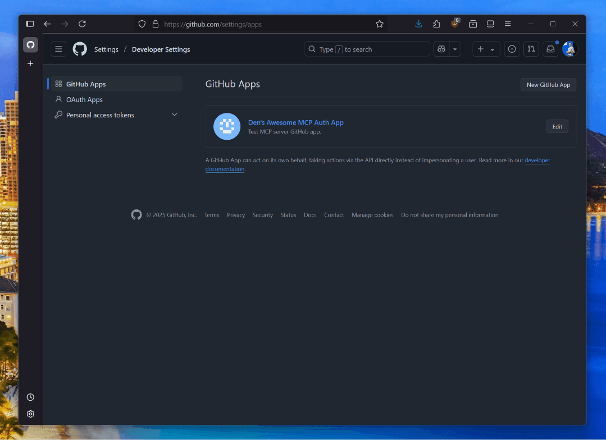
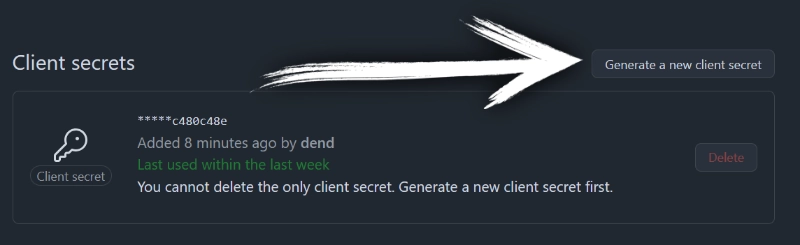

# 🔒 Minimal GitHub OAuth-enabled MCP Server

Minimal MCP server showing how to potentially implement GitHub OAuth with an MCP server.

>[!WARNING]
>This is **not intended for production use**. If you are to adopt any of the practices in this implementation, ensure that you are implementing proper caching and secure token/credential handling practices.

## GitHub application registration

Prior to using this MCP server, make sure that you have a **GitHub App** you can use for testing. You can register one [in your GitHub settings](https://github.com/settings/apps).



Once the app is registered, make sure to generate a new secret.



With the client ID and secret handy, create a new `.env` file in the root of this project, and add:

```env
GITHUB_CLIENT_ID=YOUR_CLIENT_ID
GITHUB_CLIENT_SECRET=YOUR_SECRET
```

## Run server

```bash
npm install
npm run build
npm run start
```

## Testing

You will need to use [**MCP Inspector**](https://github.com/modelcontextprotocol/inspector) or a tool that supports HTTP+SSE transport for MCP servers _and_ authentication.
